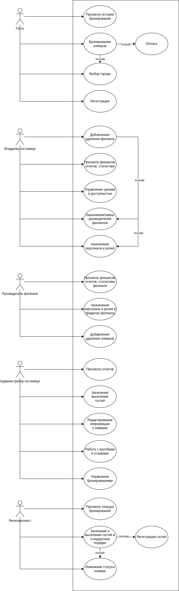
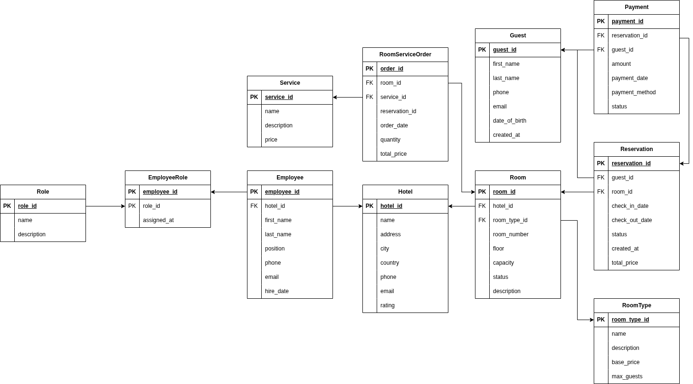

### **Описание диаграммы вариантов использования (Use Case)**
**Над диаграммой работали:**
- **Шевченко Э.** - составление и разработка диаграммы.
- **Титов М., Турищев И.** - консультация и косвенное участие в составлении.
### **Актеры системы**
1. **Гость** - рядовой посетитель веб-сайта или приложения, незарегистрированный или авторизованный пользователь, желающий воспользоваться услугами бронирования.
2. **Владелец гостиниц** - высшее руководящее лицо, управляющее всеми гостиницами и филиалами сети (Head Office).
3. **Руководитель филиала** - лицо, ответственное за управление конкретным филиалом (отелем) в рамках сети.
4. **Администратор гостиницы** - представитель среднего звена управления в отдельно взятом отеле, координирующий работу линейного персонала.
5. **Ресепшен (Reception)** - линейный сотрудник стойки регистрации, непосредственно взаимодействующий с гостями.
### **Варианты использования**
#### **Гость**
- **Регистрация** - создание учетной записи в системе.
- **Авторизация** - вход в существующую учетную запись.
- **Выбор города** - просмотр и фильтрация доступных гостиниц по местоположению.
- **Бронирование номеров** - выбор конкретного номера и дат с последующим подтверждением брони. _Данный процесс включает в себя вариант использования "Оплата"._
- **Оплата** - процесс финансового транзакционного подтверждения бронирования.
- **Просмотр истории бронирований** - возможность просмотреть свои прошлые и текущие заказы.
#### **Владелец/Головной офис гостиницы**
- **Управление филиалами** - добавление новых филиалов сети или удаление существующих.
- **Финансовый контроль** - просмотр сводных финансовых отчетов и статистики по всем филиалам. _Отчеты включают в себя данные по управлению ценами._
- **Глобальное управление ценами** - установка базовых цен и управление доступностью номеров во всей сети.
- **Управление персоналом** - назначение руководителей филиалов и глобальное распределение ролей.
#### **Руководитель филиала**
- **Локальный финансовый контроль** - просмотр финансовых отчетов и статистики только по своему филиалу.
- **Управление номерным фондом** - добавление новых номеров в филиале или удаление существующих.
- **Кадровое администрирование** - назначение персонала (администраторов, ресепшен) и распределение ролей в пределах своего филиала.
#### **Администратор гостиницы**
- **Оперативное управление** - заселение новых гостей и выселение текущих постояльцев.
- **Управление бронированиями** - корректировка, отмена или подтверждение броней, поступивших от гостей.
- **Управление номерным фондом** - редактирование информации о номерах (описание, удобства, фотографии).
- **Работа с обратной связью** - обработка жалоб и отзывов от гостей.
- **Просмотр отчетов** - просмотр операционных отчетов по загрузке отеля и работе персонала.
#### **Ресепшен**
- **Заселение и выселение гостей** - выполнение стандартных процедур check-in и check-out. _Данный процесс включает в себя изменение статуса номера._
- **Изменение статуса номера** - отметка номера как "чистый", "грязный", "на ремонте" или "свободен".
- **Просмотр текущих бронирований** - ознакомление с планом заездов на текущий день/смену.
---
### **Примечания к отношениям (Include)**
Отношение **"include"** между "Бронированием" и "Оплатой" подразумевает, что процесс бронирования не может считаться завершенным без успешного проведения оплаты.
Отношение **"include"** между действиями "Заселение/выселение" и "Изменение статуса номера" означает, что стандартная процедура заселения всегда влечет за собой смену статуса номера (например, с "свободен" на "занят").

### **Описание ER-диаграммы базы данных**
**Над диаграммой работал:**  **Шевченко Э.** - составление и разработка диаграммы.
### **Сущности и их атрибуты**
#### **1. Hotel (Отель/Филиал)**
- **hotel_id** (PK) — уникальный идентификатор отеля
- name — название отеля
- address — адрес
- city — город
- country — страна
- phone — контактный телефон
- email — контактный email
- rating — рейтинг отеля
#### **2. Room (Номер)**
- **room_id** (PK) — уникальный идентификатор номера
- **hotel_id** (FK) — ссылка на отель
- **room_type_id** (FK) — ссылка на тип номера
- room_number — номер комнаты (например, "101")
- floor — этаж
- capacity — вместимость (количество человек)
- status — текущий статус (свободен, занят, уборка и т.д.)
- description — дополнительное описание
#### **3. RoomType (Тип номера)**
- **room_type_id** (PK) — идентификатор тип
- name — название типа (стандарт, люкс и т.д.)
- description — описание типа
- base_price — базовая цена за ночь
- max_guests — максимальное количество гостей
#### **4. Guest (Гость)**
- **guest_id** (PK) — идентификатор гостя
- first_name — имя
- last_name — фамилия
- phone — телефон
- email — электронная почта
- date_of_birth — дата рождения
- created_at — дата регистрации
#### **5. Reservation (Бронирование)**
- **reservation_id** (PK) — идентификатор бронирования
- **guest_id** (FK) — ссылка на гостя
- **room_id** (FK) — ссылка на номер
- check_in_date — дата заезда
- check_out_date — дата выезда
- status — статус бронирования
- created_at — дата создания брони
- total_price — итоговая стоимость
#### **6. Payment (Платёж)**
- **payment_id** (PK) — идентификатор платежа
- **reservation_id** (FK) — ссылка на бронирование
- **guest_id** (FK) — ссылка на гостя
- amount — сумма платежа
- payment_date — дата платежа
- payment_method — способ оплаты
- status — статус платежа
#### **7. Service (Услуга)**
- **service_id** (PK) — идентификатор услуги
- name — название услуги
- description — описание
- price — стоимость
#### **8. RoomServiceOrder (Заказ услуги в номер)**
- **order_id** (PK) — идентификатор заказа
- **room_id** (FK) — ссылка на номер
- **service_id** (FK) — ссылка на услугу
- **reservation_id** (FK) — ссылка на бронирование (для привязки к конкретному проживанию)
- order_date — дата и время заказа
- quantity — количество
- total_price — итоговая стоимость заказа
#### **9. Employee (Сотрудник)**
- **employee_id** (PK) — идентификатор сотрудника
- **hotel_id** (FK) — ссылка на отель
- first_name — имя
- last_name — фамилия
- position — должность
- phone — телефон
- email — email
- hire_date — дата найма
#### **10. Role (Роль)**
- **role_id** (PK) — идентификатор роли
- name — название роли
- description — описание
#### **11. EmployeeRole (Связь сотрудников и ролей)**
- **employee_id** (PK, FK) — часть составного ключа, ссылка на сотрудника
- **role_id** (PK, FK) — часть составного ключа, ссылка на роль
- assigned_at — дата назначения роли
### **Связи между сущностями**

| Связь                              | Тип | Описание                                                             |
| ---------------------------------- | --- | -------------------------------------------------------------------- |
| **Hotel – Room**                   | 1:N | Один отель содержит много номеров.                                   |
| **RoomType – Room**                | 1:N | Один тип номера может быть у многих номеров.                         |
| **Guest – Reservation**            | 1:N | Один гость может иметь много бронирований.                           |
| **Room – Reservation**             | 1:N | Один номер может быть забронирован много раз (в разное время).       |
| **Reservation – Payment**          | 1:N | Одно бронирование может иметь несколько платежей (частичная оплата). |
| **Guest – Payment**                | 1:N | Один гость может совершить много платежей.                           |
| **Room – RoomServiceOrder**        | 1:N | В одном номере может быть оформлено несколько заказов услуг.         |
| **Service – RoomServiceOrder**     | 1:N | Одна услуга может быть заказана многократно.                         |
| **Reservation – RoomServiceOrder** | 1:N | Одно бронирование может включать несколько заказов услуг.            |
| **Hotel – Employee**               | 1:N | В одном отеле работает много сотрудников.                            |
| **Employee – EmployeeRole – Role** | M:N | Связь многие-ко-многим через промежуточную таблицу `EmployeeRole`.   |

### **Описание макета главной страницы (UI/UX)**
**Над макетом работали:**
- **Титов М.** — ведущий разработчик макета, автор визуальных решений и структуры страницы.
- **Турищев И.** — консультант, участник обсуждения и утверждения концепции (принимал активное участие в разработке идей).
### **Общая информация**
**Проект:** Сеть гостиниц **Re:Ception**  
**Тип страницы:** Главная (лендинг)  
**Основная задача:** Презентация сети отелей, быстрый переход к бронированию, демонстрация отзывов и обеспечение навигации по ключевым разделам.
Страница построена по модульному принципу и содержит следующие функциональные зоны (блоки):
### **Структура и функциональность страницы**
#### **1. Шапка сайта (Header)**
- **Логотип / Название:** **RE:Ception Гостиницы Отзывы** — кликабельный элемент, ведущий на главную страницу.
- **Навигационные ссылки (прототип меню):**
    - **«Гостиницы»** — (предположительно) ведёт к списку отелей (блок №2).
    - **«Отзывы»** — **интерактивный элемент (якорь/кнопка)**. При нажатии страница плавно прокручивается вниз к блоку «Отзывы» (блок №4).
#### **2. Блок «Сеть гостиниц Re:Ception»**
Содержит список доступных отелей сети. Каждый пункт является кликабельным и ведёт на страницу конкретного отеля.
#### **3. Детальный блок «Гостиница 2» (пример карточки отеля)**
Этот блок демонстрирует, как выглядит карточка конкретного отеля при более детальном рассмотрении (возможно, при наведении или как отдельный элемент карусели).
- **Заголовок:** Название отеля.
- **Медиа-контент:** **Изображение гостиницы**.
- **Описание:** Содержит повторяющиеся пункты «Детали о гостинице» (характеристики, удобства).
#### **4. Блок «Отзывы»**
Динамический блок, отображающий ленту отзывов гостей.
- **Заголовок:** «Отзывы».
- **Карточка отзыва (повторяющийся элемент):**
    - **Аватар:** «Фото профиля».
    - **Информация об авторе:** «Иван Иванов».
    - **Объект отзыва:** «Гостиница 1» (гиперссылка на страницу этой гостиницы).
    - **Рейтинг:** Визуальное отображение звёзд.
    - **Текст:** Текст отзыва (опционально, может отображаться не у всех превью).
Макет представляет собой классический лендинг сети отелей с удобной навигацией. Интерактивные элементы (ссылки и кнопки) обеспечивают интуитивно понятный пользовательский опыт.

[**Макет сайта**](https://www.figma.com/proto/7nulwp1MmGSbPkNAohJTPY/Untitled?node-id=1-2067&p=f&t=0oj2BKpnEhtYCki9-1&scaling=scale-down&content-scaling=fixed&page-id=0%3A1&starting-point-node-id=1%3A2067)